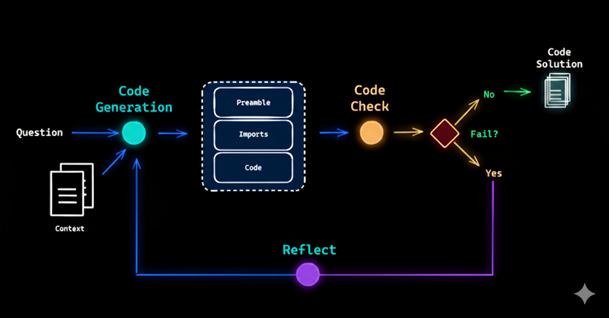
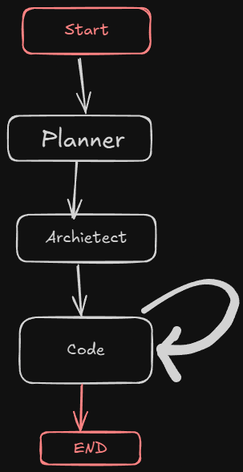

# Coding Agent

A multi-agent system built with LangGraph that automatically generates complete web applications from natural language prompts.

## Features

- **Planning Agent**: Converts user requirements into structured project plans
- **Architecture Agent**: Breaks down plans into implementation tasks
- **Coding Agent**: Generates actual code files using LLM-powered tools
- **Multi-file Support**: Creates HTML, CSS, and JavaScript files automatically

## How It Works



## Basic Workflow



The system follows a sequential workflow:

1. **Planner**: Analyzes user prompt and creates project structure
2. **Architect**: Breaks down plan into specific implementation tasks
3. **Coder**: Iteratively implements each task, creating files as needed (loops until all tasks complete)

## Installation

```bash
# Clone the repository
git clone https://github.com/Shreyas-Walde/langgraph-coding-agent.git
cd coding_agent

# Install dependencies
pip install langchain-groq langgraph python-dotenv

# Set up environment variables
cp .env.example .env
# Add your GROQ_API_KEY to .env
```

## Usage

```python
from agent.graph import agent

# Generate a complete web application
result = agent.invoke({
    "user_prompt": "Create a calculator in html css and js"
})
```

Or run directly:

```bash
python main.py
```

## Project Structure

```
agent/
├── graph.py       # Main agent workflow
├── prompts.py     # LLM prompts for each agent
├── states.py      # State management classes
├── tools.py       # File I/O tools
└── generated_projects/  # Output directory
main.py            # CLI interface
```

## Configuration

- Modify `llm` model in `graph.py` for different LLM providers
- Adjust prompts in `prompts.py` for different coding styles
- Configure recursion limits for complex projects

## Requirements

- Python 3.12+
- GROQ API key
- LangChain and LangGraph